# PES1UG24CS901 — PES-VCS: Building a Version Control System

**Name:** Vivian Sobers  
**SRN:** PES1UG24CS901  
**Class:** 4 'C'  

---

## Overview

PES-VCS is a simplified version control system built from scratch in C, modeled after Git's internal design. It implements content-addressable object storage, a staging area, tree objects, and a commit history chain — all using core operating system and filesystem concepts.

---

## Building

```bash
sudo apt update && sudo apt install -y gcc build-essential libssl-dev
make          # Build the pes binary
make all      # Build pes + test binaries
make clean    # Remove all build artifacts
```

## Usage

```bash
export PES_AUTHOR="Your Name <your@email.com>"
./pes init
./pes add <file>...
./pes status
./pes commit -m "message"
./pes log
```

---

## Phase 1 — Object Storage Foundation

**Concepts:** Content-addressable storage, directory sharding, atomic writes, SHA-256 hashing

**Files implemented:** `object.c`

### What was implemented

- **`object_write`** — Prepends a type header (`"blob <size>\0"`), computes SHA-256 of the full object, checks for deduplication, creates the shard directory, writes to a temp file, fsyncs, then atomically renames to the final path.
- **`object_read`** — Reads the object file, recomputes the SHA-256 and compares it to the filename to verify integrity, parses the type header, and returns the raw data.

### Testing

```bash
make test_objects
./test_objects
find .pes/objects -type f
```

### Screenshots

**Screenshot 1A — `./test_objects` passing**

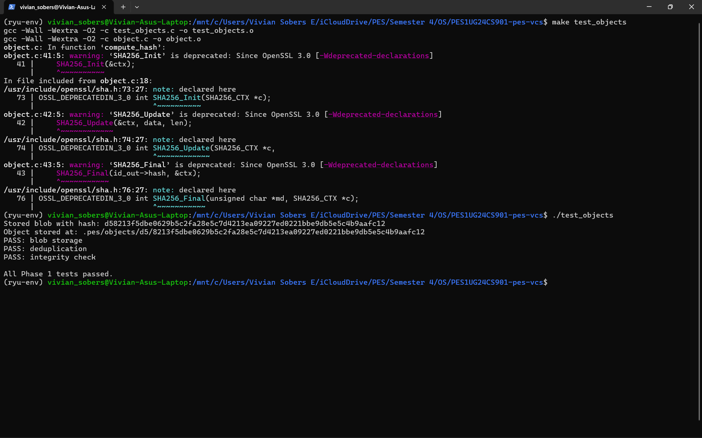

**Screenshot 1B — Sharded object store structure**

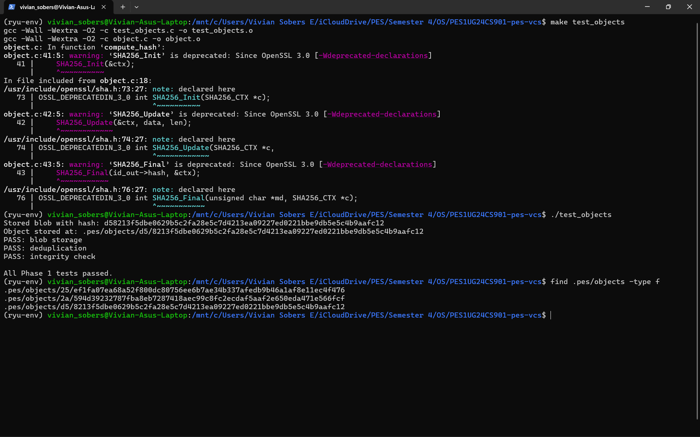

---

## Phase 2 — Tree Objects

**Concepts:** Directory representation, recursive structures, file modes and permissions

**Files implemented:** `tree.c`

### What was implemented

- **`tree_parse`** — Parses the binary tree format (`"<mode> <name>\0<32-byte-hash>"`) into a `Tree` struct entry by entry using `memchr` for safe boundary checking.
- **`tree_serialize`** — Sorts entries by name (required for deterministic hashing), then writes each entry in binary format using `sprintf` for the mode/name and `memcpy` for the raw hash bytes.
- **`tree_from_index`** — Loads the index and recursively builds a tree hierarchy using `write_tree_level`, which groups entries by their first path component — flat files become blob entries and nested paths trigger recursion to build subtrees.

### Testing

```bash
gcc -Wall -O2 -c index.c -o index.o
gcc -Wall -O2 -o test_tree test_tree.o object.o tree.o index.o -lcrypto
./test_tree
find .pes/objects -type f
xxd .pes/objects/XX/YYYY... | head -20
```

### Screenshots

**Screenshot 2A — `./test_tree` passing**

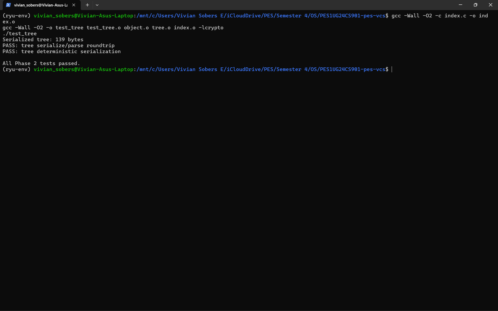

**Screenshot 2B — Raw binary tree object (xxd)**

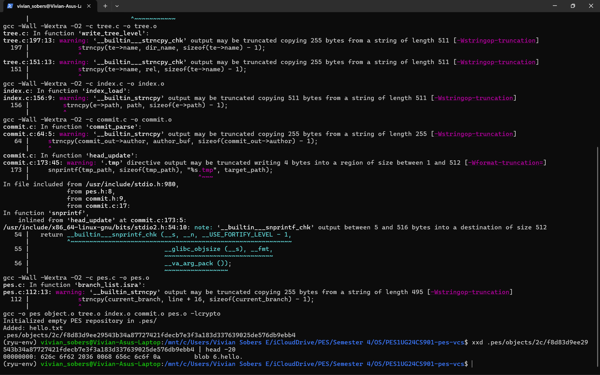

---

## Phase 3 — Index (Staging Area)

**Concepts:** File format design, atomic writes, change detection using mtime and size

**Files implemented:** `index.c`

### What was implemented

- **`index_load`** — Reads `.pes/index` line by line using `fscanf`, parsing `<mode> <hex-hash> <mtime> <size> <path>`. Returns an empty index if the file doesn't exist yet.
- **`index_save`** — Sorts entries by path using `qsort`, writes to a temp file, calls `fflush` + `fsync` to ensure durability, then atomically renames to `.pes/index`.
- **`index_add`** — Reads the file contents, writes them as a blob via `object_write`, captures metadata (`mtime`, `size`, `mode`) via `lstat`, then upserts the entry in the index.

### Testing

```bash
./pes init
echo "Hello" > file1.txt
echo "World" > file2.txt
./pes add file1.txt file2.txt
./pes status
cat .pes/index
```

### Screenshots

**Screenshot 3A — `pes init` → `pes add` → `pes status`**

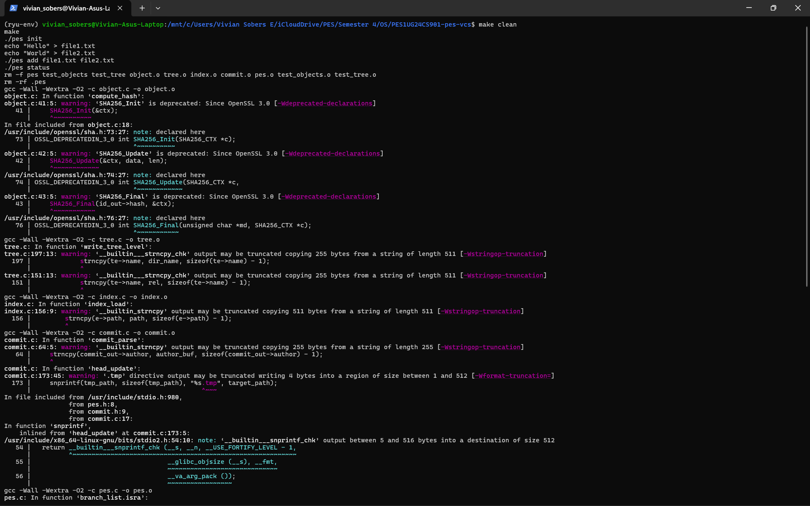

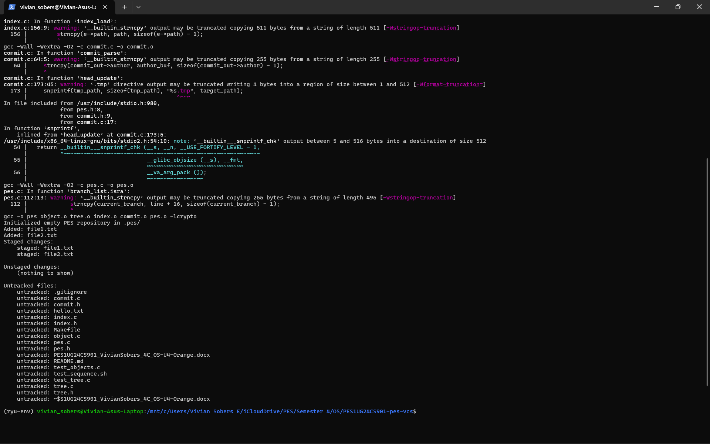

**Screenshot 3B — `.pes/index` text format**

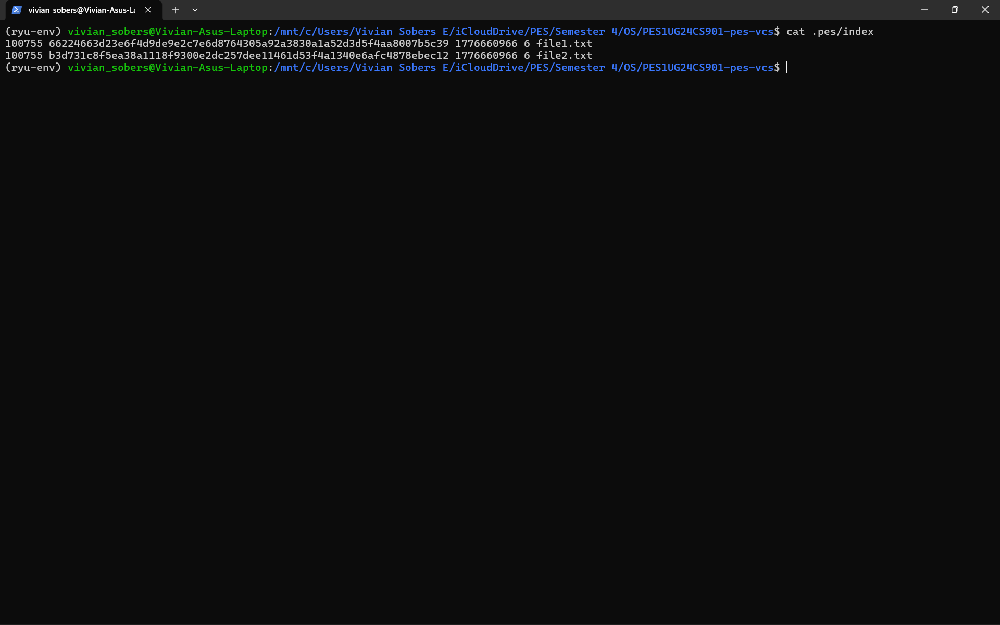

---

## Phase 4 — Commits and History

**Concepts:** Linked structures on disk, reference files, atomic pointer updates

**Files implemented:** `commit.c`, `pes.c`

### What was implemented

- **`commit_create`** — Calls `tree_from_index` to snapshot the staged state, reads HEAD as the parent commit (skipped for the first commit), fills the `Commit` struct with author, timestamp and message, serializes it, writes it as an object, then atomically updates the branch ref via `head_update`.
- **`cmd_commit`** in `pes.c` — Parses `-m <message>` from command-line arguments, calls `commit_create`, and prints the first 12 hex characters of the new commit hash.

### Testing

```bash
./pes commit -m "Initial commit"
echo "More" >> file1.txt
./pes add file1.txt
./pes commit -m "Update file1"
echo "Bye" > bye.txt
./pes add bye.txt
./pes commit -m "Add bye.txt"
./pes log
find .pes -type f | sort
cat .pes/refs/heads/main
cat .pes/HEAD
```

### Screenshots

**Screenshot 4A — `pes log` showing 3 commits**

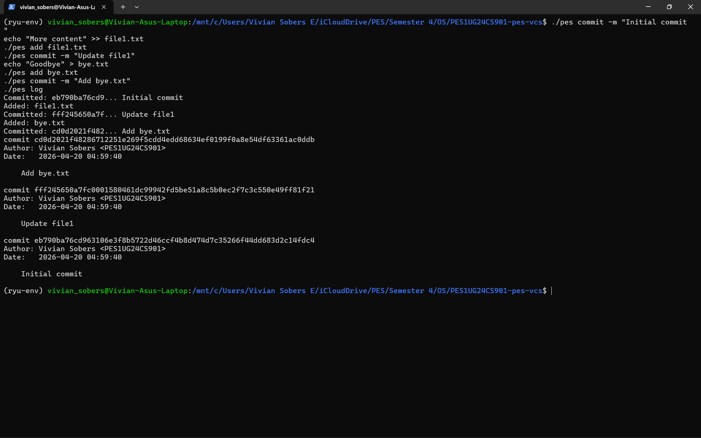

**Screenshot 4B — Object store growth after 3 commits**

**Screenshot 4C — Reference chain (HEAD → branch → commit)**

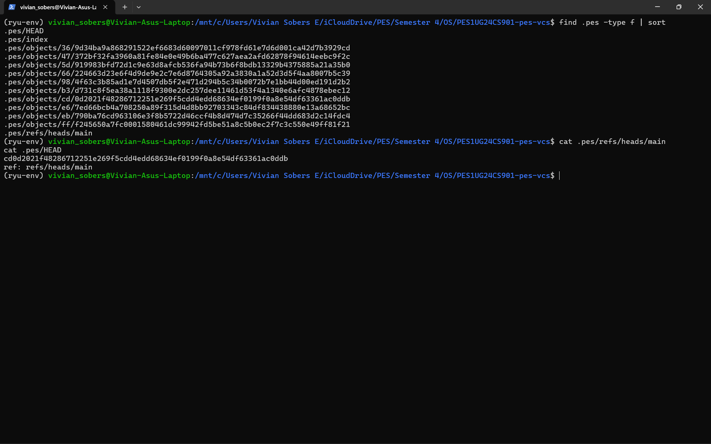


---

## Final Integration Test

```bash
make test-integration
```

**Screenshot — Full integration test passing**

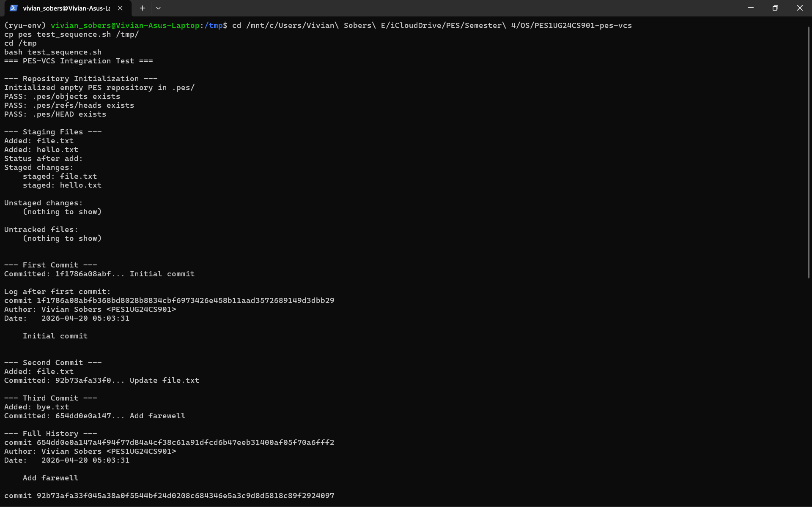

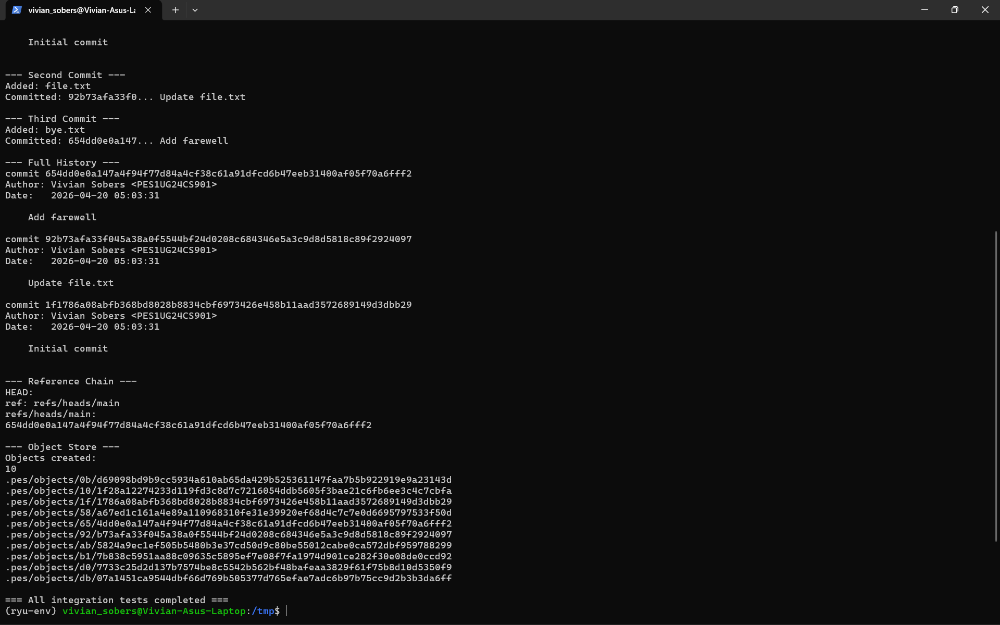

---

## Analysis Questions

### Q5 — Branching and Checkout

**Q5.1 — How would you implement `pes checkout <branch>`?**

To switch branches, three things need to change in `.pes/`:

1. **Update HEAD** — write `ref: refs/heads/<branchname>` into `.pes/HEAD`
2. **Update the working directory** — read the target branch's commit, walk its tree object, and for every file in that tree write the blob contents back to disk
3. **Update the index** — replace all index entries with the entries from the target tree

What makes this complex is handling files that exist in the current branch but not the target — those need to be deleted from disk. Files that exist in both but differ need to be overwritten. The operation must be done carefully to avoid leaving the working directory in a half-switched state if something fails midway.

---

**Q5.2 — How would you detect a dirty working directory conflict?**

Before switching, for every file in the index:

1. Check if the file on disk differs from the index entry using `mtime` and `size`
2. If it differs, the file has unstaged changes
3. Also check if the index entry differs from HEAD's tree — if so, there are staged but uncommitted changes

If either condition is true for any file that also differs between the two branches, refuse the checkout and print an error. This way we only block the switch when there is an actual conflict — files identical between branches can be safely overwritten even if locally modified.

---

**Q5.3 — What happens in detached HEAD state?**

When HEAD contains a commit hash directly instead of a branch reference, new commits are written and HEAD is updated to the new hash — but no branch pointer moves. This means once you switch away, those commits become unreachable from any branch.

To recover them a user can:
1. Use `git reflog` to find the lost commit hash in the operation log
2. Create a new branch pointing to it: `git branch recovery <hash>`

In PES-VCS without a reflog, recovery would require manually scanning `.pes/objects/` to find the orphaned commit object and then manually writing its hash into a new branch ref file.

---

### Q6 — Garbage Collection

**Q6.1 — Algorithm to find and delete unreachable objects**

Use a **mark and sweep** approach:

**Mark phase:**
- Start from every branch ref in `.pes/refs/heads/`
- Walk the full commit chain for each branch
- For every commit, collect its tree hash, then recursively collect all blob and subtree hashes from that tree
- Store all reachable hashes in a hash set

**Sweep phase:**
- List every file in `.pes/objects/` by scanning subdirectories
- Convert each path back to a full hash
- Delete any object whose hash is not in the reachable set

The most efficient data structure for tracking reachable hashes is a **hash set** (e.g. a hash table or bitset indexed by hash prefix) which gives O(1) lookup per object.

For a repository with 100,000 commits and 50 branches, assuming an average of 50 files per commit, you would need to visit roughly 100,000 commit objects + 100,000 tree objects + up to 5,000,000 blob references. In practice deduplication means many blobs are shared across commits, so the actual number of unique objects visited would be significantly lower — likely in the hundreds of thousands.

---

**Q6.2 — Race condition between GC and concurrent commit**

The race condition scenario:

1. A commit operation calls `object_write` for a new blob — the blob is stored in `.pes/objects/`
2. Before the commit object is written and HEAD is updated, GC runs
3. GC sees the blob has no commit pointing to it yet — it appears unreachable
4. GC deletes the blob
5. The commit finishes and writes a commit object referencing the now-deleted blob
6. The repository is now corrupt — the commit points to a missing object

**How Git avoids this:**

Git uses a **grace period** — GC never deletes objects newer than 2 weeks old by default. Any recently written object is safe even if not yet reachable from any branch. Git also uses lock files during GC so concurrent writes can detect and defer. Additionally, Git always writes objects before updating any references, minimizing the window where an object exists but is temporarily unreachable.

---

## Author

Vivian Sobers E
